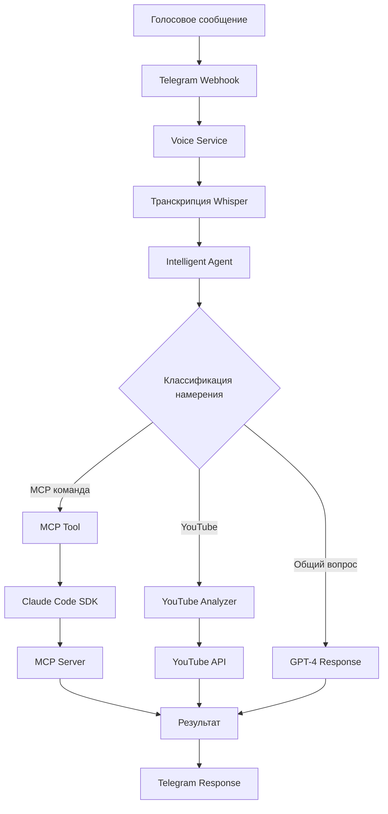

# MCP Voice-to-Command Architecture

## Обзор архитектуры

Система построена на основе интеграции голосового управления с Model Context Protocol (MCP) через Telegram бота с использованием Intelligent Agent для обработки естественного языка.

## Компоненты системы

### 1. Voice Service (voice/)
- **telegram_audio.py** - скачивание голосовых файлов из Telegram
- **whisper_client.py** - транскрипция через OpenAI Whisper API
- **voice_service.py** - главный сервис обработки голоса

### 2. Intelligent Agent (agent/)
- **intelligent_agent.py** - агент с OpenAI Function Calling
- **tool_registry.py** - реестр доступных инструментов
- **intent_classifier.py** - классификация намерений пользователя
- **confirmation_manager.py** - управление подтверждениями
- **conversation_state.py** - состояние диалога

### 3. Инструменты (agent/tools/)
- **mcp_tool.py** - выполнение MCP команд через Claude Code SDK
- **youtube_analyzer_tool.py** - анализ YouTube видео

### 4. Telegram Bot (bot/)
- **webhook/handlers.py** - обработка входящих сообщений
- **services/intelligent_agent_service.py** - интеграция с Intelligent Agent
- **services/claude_code_service.py** - взаимодействие с Claude Code SDK

## Поток обработки голосовых команд



## Ключевые изменения

### До (старая архитектура):
- Голосовые сообщения → Транскрипция → Прямая отправка в MCP
- Проблема: MCP не понимал общие вопросы типа "Какие у тебя инструменты?"

### После (новая архитектура):
- Голосовые сообщения → Транскрипция → Intelligent Agent → Выбор инструмента
- Преимущество: Естественное понимание запросов и интеллектуальный выбор действий

## Примеры использования

### 1. Вопрос об инструментах
**Голос**: "Какие у тебя есть инструменты?"
**Процесс**:
1. Транскрипция: "Какие у тебя есть инструменты?"
2. Intent: TOOL_INQUIRY
3. Response: Список доступных инструментов с описанием

### 2. MCP команда
**Голос**: "Покажи список приложений в DigitalOcean"
**Процесс**:
1. Транскрипция: "Покажи список приложений в DigitalOcean"
2. Intent: MCP_COMMAND
3. Tool: mcp_executor
4. Command: /mcp apps
5. Response: Список приложений из DigitalOcean

### 3. Анализ YouTube
**Голос**: "Проанализируй видео [URL]"
**Процесс**:
1. Транскрипция с URL
2. Intent: YOUTUBE_ANALYSIS
3. Tool: youtube_analyzer
4. Response: Анализ видео

## Конфигурация

### Переменные окружения (.env):
```bash
# Голосовые сообщения
VOICE_ENABLED=true
OPENAI_API_KEY=sk-...

# Intelligent Agent
ANTHROPIC_API_KEY=sk-ant-...

# MCP интеграция
MCP_ENABLED=true
DIGITALOCEAN_TOKEN=dop_v1_...
```

### Требования:
- OpenAI API для Whisper и GPT-4
- Anthropic API для Claude Code SDK
- Telegram Bot Token
- MCP серверы (DigitalOcean, Supabase, etc.)

## Тестирование

1. **Unit тесты**:
   - test_voice_to_agent.py - проверка интеграции
   - test_agent_selection.py - выбор правильного агента

2. **Интеграционные тесты**:
   - Запуск локального webhook
   - Отправка голосовых сообщений
   - Проверка правильности обработки

3. **Debug endpoints**:
   - `/debug/last-updates` - последние обновления
   - `/debug/voice-status` - статус Voice Service
   - `/agent` - статус Intelligent Agent

## Развертывание

### Локальная разработка:
```bash
# Запуск webhook
python webhook.py

# Установка ngrok туннеля
python setup_local_webhook.py

# Мониторинг логов
tail -f webhook.log
```

### Production (Railway):
- Автоматический деплой из GitHub
- Переменные окружения в Railway
- Мониторинг через railway logs

## Будущие улучшения

1. **Контекстная память**: Сохранение истории диалогов для лучшего понимания
2. **Мультиязычность**: Автоопределение языка и ответ на том же языке
3. **Batch операции**: Выполнение нескольких команд из одного голосового сообщения
4. **Streaming ответы**: Отправка частичных результатов по мере выполнения
5. **Voice feedback**: Голосовые ответы вместо текста