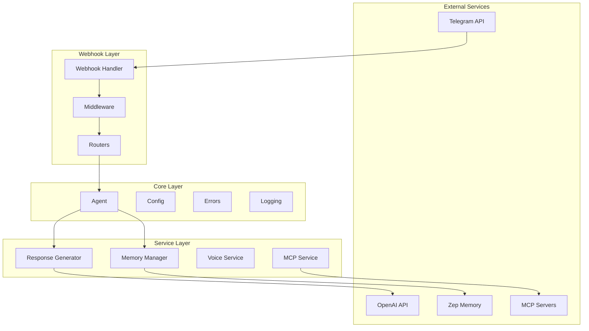
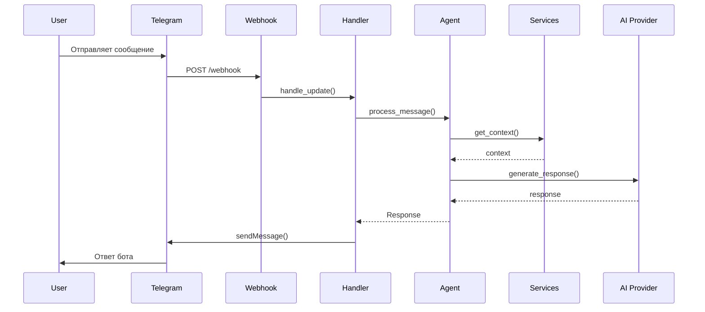

# 🏗️ Архитектура Artyom Integrator

> **Обновлено**: Январь 2025  
> **Версия**: 2.0 с полной поддержкой MCP

## Обзор

Artyom Integrator построен на модульной архитектуре с четким разделением ответственности между компонентами. Проект использует современные паттерны проектирования для обеспечения масштабируемости и поддерживаемости.

## Основные принципы

1. **Модульность** - каждый компонент имеет четкую ответственность
2. **Типизация** - использование type hints и dataclasses
3. **Dependency Injection** - слабая связанность компонентов
4. **Async First** - асинхронная архитектура для производительности
5. **Error Handling** - централизованная обработка ошибок

## Архитектурные слои

### 1. Core Layer (Ядро)

```
bot/core/
├── interfaces.py    # Базовые интерфейсы и контракты
├── config.py        # Типизированная конфигурация
├── agent.py         # Базовый AI агент
├── errors.py        # Система обработки ошибок
├── monitoring.py    # Мониторинг и метрики
└── logging/         # Централизованное логирование
```

**Ответственность:**
- Определение базовых абстракций
- Управление конфигурацией
- Обработка ошибок и логирование
- Мониторинг производительности

### 2. Service Layer (Сервисы)

```
bot/services/
├── memory_manager.py       # Управление памятью диалогов
├── response_generator.py   # Генерация AI ответов
├── voice_service.py        # Обработка голоса
├── social_media_service.py # Интеграция с соцсетями
└── mcp_service.py          # MCP интеграция
```

**Ответственность:**
- Бизнес-логика приложения
- Интеграция с внешними API
- Обработка специфичных типов контента

### 3. Webhook Layer (HTTP слой)

```
bot/webhook/
├── app.py          # FastAPI приложение
├── handlers.py     # Обработчики Telegram updates
├── middleware.py   # Middleware компоненты
├── routers/        # API endpoints
└── services.py     # Webhook-специфичные сервисы
```

**Ответственность:**
- Прием и валидация HTTP запросов
- Маршрутизация запросов
- Безопасность и аутентификация
- Отправка ответов

### 4. MCP Layer (Model Context Protocol)

```
bot/mcp/
├── core/           # Ядро MCP
├── servers/        # Реализации серверов
└── handlers/       # Обработчики команд
```

**Ответственность:**
- Управление MCP серверами
- Выполнение MCP функций
- Форматирование результатов

## Диаграммы

### Общая архитектура



### Поток обработки сообщения



## Компоненты

### 1. Configuration System

Использует dataclasses для типобезопасной конфигурации:

```python
@dataclass
class TelegramConfig:
    token: str
    bot_id: int
    bot_username: str
    webhook_url: Optional[str] = None
```

### 2. Agent System

Базовый агент с поддержкой различных провайдеров:

```python
class BaseAgent(ABC):
    @abstractmethod
    async def process_message(self, message: Message) -> Response:
        pass
```

### 3. Service Architecture

Сервисы реализуют паттерн Strategy:

```python
class BaseService(ABC):
    @abstractmethod
    async def process(self, data: Any) -> Any:
        pass
```

### 4. Error Handling

Централизованная обработка с пользовательскими исключениями:

```python
class BotError(Exception):
    def __init__(self, message: str, user_message: str):
        self.user_message = user_message
```

### 5. Monitoring

Встроенный мониторинг производительности:

```python
@monitor_performance
async def process_request():
    # автоматический сбор метрик
    pass
```

## Паттерны проектирования

### 1. Factory Pattern

Используется для создания агентов и сервисов:

```python
class AgentFactory:
    @staticmethod
    def get_agent() -> BaseAgent:
        if config.openai.enabled:
            return OpenAIAgent()
        return AnthropicAgent()
```

### 2. Strategy Pattern

Для различных стратегий обработки:

```python
class ResponseStrategy(ABC):
    @abstractmethod
    def generate(self, context: Context) -> str:
        pass
```

### 3. Observer Pattern

Для системы событий:

```python
class EventEmitter:
    def emit(self, event: str, data: Any):
        for listener in self.listeners[event]:
            listener(data)
```

### 4. Singleton Pattern

Для глобальных сервисов:

```python
class ConfigManager:
    _instance = None
    
    def __new__(cls):
        if not cls._instance:
            cls._instance = super().__new__(cls)
        return cls._instance
```

## Безопасность

### 1. Аутентификация

- Webhook token для проверки запросов от Telegram
- Admin token для административных endpoints
- Двухфакторная проверка администраторов

### 2. Авторизация

- Role-based access control (RBAC)
- Проверка прав на уровне функций
- Аудит всех административных действий

### 3. Валидация

- Pydantic модели для входных данных
- Санитизация пользовательского ввода
- Проверка типов на этапе выполнения

## Масштабирование

### 1. Горизонтальное масштабирование

- Stateless архитектура
- Внешнее хранилище состояния (Zep)
- Поддержка нескольких инстансов

### 2. Кеширование

- In-memory кеш для MCP результатов
- TTL для автоматической очистки
- Кеширование на уровне HTTP (CDN)

### 3. Оптимизация

- Асинхронная обработка
- Connection pooling
- Lazy loading компонентов

## Best Practices

### 1. Код

- Type hints везде
- Docstrings для публичных методов
- Именование по PEP 8
- DRY принцип

### 2. Тестирование

- Unit тесты для бизнес-логики
- Integration тесты для API
- Mocking внешних сервисов
- Coverage > 80%

### 3. Деплой

- Environment-based конфигурация
- Graceful shutdown
- Health checks
- Автоматический rollback

## Расширение

### Добавление нового сервиса

1. Создайте класс в `bot/services/`
2. Наследуйте от `BaseService`
3. Реализуйте метод `process()`
4. Зарегистрируйте в конфигурации

### Добавление нового MCP сервера

1. Создайте класс в `bot/mcp/servers/`
2. Наследуйте от `MCPServer`
3. Реализуйте требуемые методы
4. Добавьте в реестр серверов

### Добавление нового endpoint

1. Создайте router в `bot/webhook/routers/`
2. Определите endpoints
3. Добавьте в `app.py`
4. Обновите документацию API